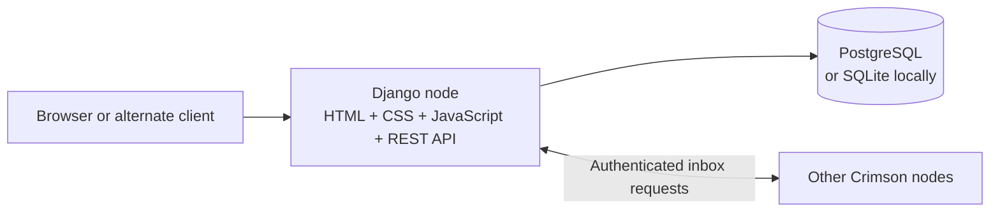
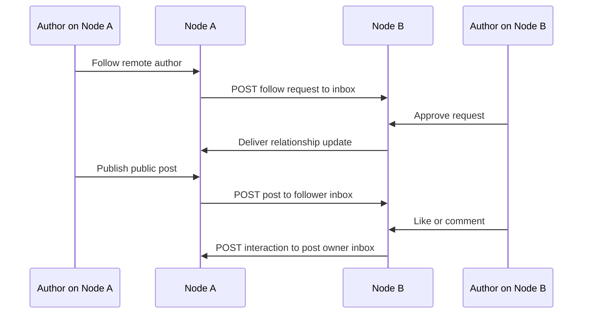

# Crimson

> A social network with no single home.

Crimson is a federated social network made of independently operated nodes. Each node is a complete web application with its own users, database, media, moderation, and administration. Nodes can still discover one another and exchange posts, follow requests, comments, and likes through authenticated APIs.

The result feels like one connected social network, but control remains distributed. A community can run its own node, define its own membership rules, and participate in the wider network without handing its entire social graph to a central platform.

<p align="center">
  
  
  
  
  
</p>

## The Crimson idea

Traditional social media asks everyone to use one service. Crimson asks a more interesting question:

> What if communities could own their own social servers and still talk to everyone else?

Every Crimson node is both a **home** and a **neighbour**:

```text
         Node A                                  Node B
  ┌──────────────────┐                   ┌──────────────────┐
  │ users            │                   │ users            │
  │ posts            │  authenticated   │ posts            │
  │ database         │◄──── API ───────► │ database         │
  │ moderation       │                   │ moderation       │
  └──────────────────┘                   └──────────────────┘
```

Node A does not read Node B’s database. Instead, the two servers exchange carefully shaped events through inbox endpoints. Each node keeps ownership of the data it creates and a local copy of the remote data it has received.

## A user’s journey

Imagine two people who live on different nodes.

1. One author finds the other through a public profile.
2. They send a follow request across the network.
3. The receiving author approves it from their own node.
4. A new public post is pushed to the follower’s inbox.
5. The follower comments or likes the post.
6. That interaction travels back to the node that owns the original post.

The browser stays connected to the user’s home node throughout the experience. Federation is handled by the servers behind the scenes.

## Features

### Write and share

- Create plain-text, Markdown/CommonMark, and image posts.
- Set each post to **public**, **unlisted**, or **friends-only**.
- Edit a post without changing its identity or URL.
- Delete a post while retaining an administrator-only record for moderation and review.
- Share public and unlisted posts by link.

### Follow and connect

- Browse public authors and public posts.
- Follow people on the local node or a remote node.
- Approve or reject incoming follow requests.
- Unfollow authors and end friendships.
- Treat two authors as friends only after both directions of the relationship are approved.

### React and talk

- Comment on posts that the current author can access.
- Like posts and comments.
- Deliver remote comments and likes back to the object’s owning node.
- Build a chronological stream from local content and content delivered from followed authors.

### Run a node

- Approve or reject local signups.
- Manage authors and hosted images.
- Add, edit, disable, and remove remote-node connections.
- Control the credentials used for node-to-node requests.
- Review deleted posts that are hidden from ordinary users.

## Architecture

Crimson deliberately serves the browser interface and the REST API from the same Django application. That keeps a node simple to deploy and gives the application one place to enforce visibility and permissions.



### Federation is push-based

When a local author creates an object, the owning node decides which remote inboxes should receive it and sends the object with an HTTP `POST` request. The receiving node authenticates the request, validates the payload, stores the object, and makes it available to the appropriate local stream.



### Fully qualified IDs prevent collisions

Local database IDs are not enough in a distributed system. Two nodes can both have an author with ID `7`. Crimson therefore identifies cross-node objects by their full URL:

```text
https://node-a.example/api/authors/7/
https://node-b.example/api/authors/7/
```

The host is part of the identity. Remote authors, posts, comments, and likes can be stored safely without confusing objects that happen to share a local identifier.

## Repository map

The source is organized by the part of the social network each Django app owns. The paths below are the real runtime paths; keeping them stable preserves Django imports, migrations, and deployment configuration.

```text
.
├── accounts/                 Identity and social relationships
│   ├── models.py             Author, Follow, FollowRequest
│   ├── views.py              Profiles, auth, author APIs, inbox handling
│   ├── serializers.py        Author and relationship JSON
│   ├── forms.py              Signup and profile forms
│   ├── signals.py            User/author lifecycle hooks
│   ├── utils.py              FQID and relationship helpers
│   ├── templates/             Login, signup, profiles, follow requests
│   ├── migrations/            Account schema history
│   └── management/commands/   Account-related development commands
├── posts/                    Posts, streams, images, and post delivery
│   ├── models.py             Entry and HostedImage
│   ├── views.py              Streams, entry pages, APIs, deletion
│   ├── utils.py              Visibility and federation helpers
│   ├── templates/             Stream, entry, and deleted-post pages
│   ├── templatetags/          Markdown rendering helpers
│   ├── migrations/            Post and media schema history
│   └── management/commands/   Operational commands
├── interactions/             Comments, likes, and reactions
│   ├── models.py             Comment and Like
│   ├── views.py              Browser and REST interaction endpoints
│   ├── serializers.py        Interaction JSON
│   ├── templatetags/          Interaction template helpers
│   └── migrations/            Interaction schema and constraints
├── nodes/                    Remote-node administration
│   ├── models.py             RemoteNode connection records
│   ├── authentication.py     Node-to-node authentication
│   ├── views.py              Node admin pages and APIs
│   ├── forms.py               Remote-node forms
│   └── utils.py               Remote delivery helpers
├── core/                     Shared project-level Django hooks
├── socialdistribution/       Django project configuration
│   ├── settings.py            Environment, database, static, and media config
│   ├── urls.py                Root URL router
│   ├── asgi.py                ASGI entry point
│   └── wsgi.py                Gunicorn/WSGI entry point
├── templates/                Shared base template
├── static/                   Editable CSS and JavaScript
├── staticfiles/              Collected static output for deployment
├── media/                    Local development media
├── docs/                     API, architecture, and development notes
├── manage.py                 Django command-line entry point
├── Procfile                  Gunicorn deployment command
├── requirements.txt          Pinned Python dependencies
└── node_urls.txt             Development node URL list
```

### Where to make a change

| You want to change… | Start here |
| --- | --- |
| Profile fields, follows, signup, or inbox author handling | `accounts/` |
| Post creation, stream filtering, visibility, or media | `posts/` |
| Comments, likes, or interaction delivery | `interactions/` |
| Remote-node credentials and node administration | `nodes/` |
| Shared layout | `templates/base.html` |
| Browser styling and behavior | `static/css/` and `static/js/` |
| Database schema | The relevant app’s `models.py`, then create a migration |
| Global routes or environment settings | `socialdistribution/` |

## Data model

Crimson uses normalized relational tables rather than storing growing lists inside a single record.

| Model | Responsibility | Key relationships |
| --- | --- | --- |
| `Author` | Local or remote identity | Local Django `User`, followers, following, posts, comments, likes |
| `FollowRequest` | Pending or resolved follow intent | Actor, target, and status |
| `Follow` | An accepted following edge | Follower → followee |
| `Entry` | A post and its visibility | Author, optional remote author, comments, likes, media |
| `HostedImage` | An image uploaded for use in posts | Owning local user |
| `Comment` | A response to an entry | Author and parent entry |
| `Like` | A reaction to an entry or comment | Author and exactly one target |
| `RemoteNode` | A trusted federation connection | URL, credentials, active state |

Every cross-node object also has an FQID. This is the key that lets one node store a remote object without pretending that its local database ID is globally meaningful.

## Visibility and deletion

| Entry state | Appears in streams | Direct link | Interaction access |
| --- | --- | --- | --- |
| Public | Everyone | Everyone | Anyone with access |
| Unlisted | Followers and relevant inboxes | Anyone with the link | Anyone with access |
| Friends-only | Approved mutual friends | Restricted | Author and approved friends |
| Deleted | Nobody | Node administrator only | No likes or comments |

Deleting a post is a state transition. The record remains available to the node administrator, while ordinary feeds, profiles, and API responses hide it. A deletion notification can also be delivered to remote inboxes that previously received the post.

## API surface

The browser routes and machine-readable routes are served by the same Django node.

| Area | Browser examples | API responsibility |
| --- | --- | --- |
| Accounts | `/authors/`, `/login/`, `/signup/`, `/follow-requests/` | Authors, relationships, profiles, follow requests, inboxes |
| Posts | `/posts/stream/`, `/posts/entry/<id>/` | Entries, streams, images, deletion, post details |
| Interactions | `/interactions/like/...`, comment forms | Comments, likes, and interaction retrieval |
| Nodes | `/nodes/` | Remote-node administration and node records |
| Administration | `/admin/`, `/posts/admin/deleted/` | Django administration and deleted-post review |

See [`docs/API_INDEX.md`](docs/API_INDEX.md) for the detailed endpoint documents and example payloads.

## Run Crimson locally

### 1. Install dependencies

```bash
python -m venv .venv
source .venv/bin/activate       # macOS/Linux
# .venv\Scripts\activate       # Windows PowerShell
pip install -r requirements.txt
```

### 2. Add local environment values

Create a `.env` file in the repository root:

```dotenv
DEBUG=True
SECRET_KEY=replace-this-for-local-development
NODE_BASE_URL=http://127.0.0.1:8000
ALLOWED_HOSTS=127.0.0.1,localhost
DATABASE_URL=sqlite:///db.sqlite3
```

SQLite is convenient for a local node. Use PostgreSQL when running a deployed node. Cloudinary variables are only needed when using the cloud media backend.

### 3. Prepare and start the node

```bash
python manage.py migrate
python manage.py collectstatic --noinput
python manage.py createsuperuser
python manage.py runserver
```

Open `http://127.0.0.1:8000/`, sign in, and create or approve an author. To run a second local node, use another port, another database, and a different `NODE_BASE_URL`.

## Deploy a node

The included `Procfile` starts Gunicorn with the Django WSGI application:

```text
web: gunicorn socialdistribution.wsgi
```

A deployed node should configure:

- `SECRET_KEY` — a strong private key.
- `DEBUG=False` — the production setting.
- `ALLOWED_HOSTS` — the node’s hostnames.
- `NODE_BASE_URL` — the public URL used to generate FQIDs.
- `DATABASE_URL` — a PostgreSQL connection URL.
- `NODE_USERNAME` and `NODE_PASSWORD` — credentials for configured node-to-node requests.
- `CLOUDINARY_CLOUD_NAME`, `CLOUDINARY_API_KEY`, and `CLOUDINARY_API_SECRET` when using Cloudinary media storage.

Each node should have its own public URL and database. Sharing a database between nodes would defeat the ownership model and can create identity collisions.

## Test and debug

```bash
python manage.py check
python manage.py test
```

For a two-node smoke test:

```text
Node A author
  → follows Node B author
  → Node B approves the request
  → Node A publishes a public post
  → Node B receives the post in an inbox
  → Node B comments or likes it
  → Node A receives the interaction
```

When federation fails, inspect the sender’s outbound request, the receiver’s inbox response, the stored FQID, and the visibility filter that controls the stream.

## Documentation

- [`docs/PROJECT_STRUCTURE.md`](docs/PROJECT_STRUCTURE.md) — file-by-file ownership map.
- [`docs/ARCHITECTURE.md`](docs/ARCHITECTURE.md) — request flow, federation flow, persistence, and authorization boundaries.
- [`docs/DEVELOPMENT.md`](docs/DEVELOPMENT.md) — local setup, tests, seed data, and deployment checklist.
- [`docs/API_INDEX.md`](docs/API_INDEX.md) — index of all detailed API contracts.
- [`docs/AUTHORS.md`](docs/AUTHORS.md) — author, relationship, and inbox APIs.
- [`docs/posts.md`](docs/posts.md) — post models, visibility, streams, and post APIs.
- [`docs/INTERACTIONS_API.md`](docs/INTERACTIONS_API.md) — comments and likes API.
- [`docs/INTERACTIONS_UI.md`](docs/INTERACTIONS_UI.md) — browser interaction routes.
- [`docs/NODES.md`](docs/NODES.md) — remote-node administration and authentication.
- [`docs/UserStories.md`](docs/UserStories.md) — behavior and acceptance notes.

## License

Crimson is distributed under the MIT License. See [`LICENSE`](LICENSE).
